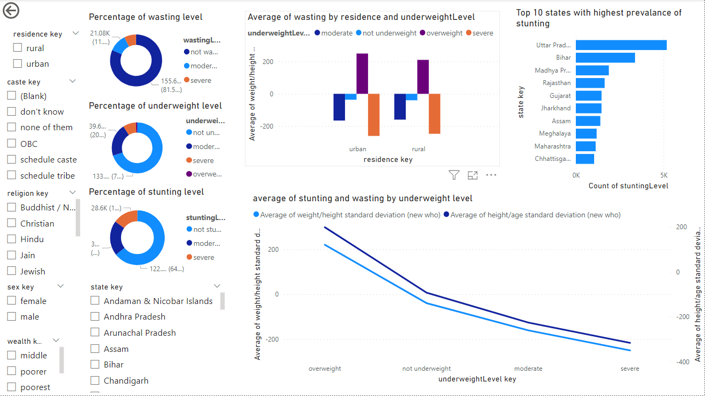

# powerBI_SOP: Prevalence of Malnutrition among Children under-5 in India

## Collection of Data

- Collect NFHS -3,4,5 data from https://dhsprogram.com/data/dataset/India_Standard-DHS_2020.cfm?flag=1 
- Data is analyzed and Constructs are identifed.

## Dimensional Modeling

- Fact table and Dimension tables are identified for KPI and scores that are calcultaed using AHP technique.
- The schema is visualizes in Power BI as a Star schema to identify the ONE TO MANY relationships.

## Report Designing

- Power BI is used for data visualization given its wide range of visualization tools.
- An interactive dashboard can be built using Power BI with the help of slicers.
- Findings were drawn based on the graphs/charts that are plotted using the schema.
- One example visualization of malnutrition construct analysed is shown below:

### Findings:  
- Children in rural areas have a higher prevalence of underweight, while urban areas have a
higher prevalence of overweight.
- Bihar and Uttar Pradesh have a marginally higher prevalence of stunting.

